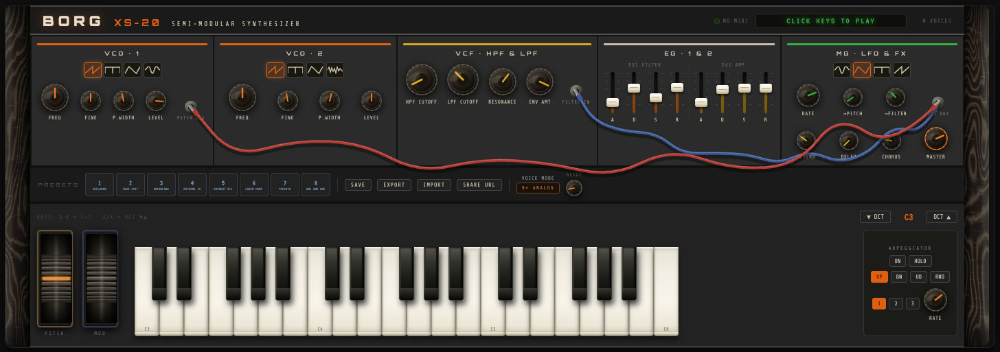

# 🎛️ BORG XS-20



> A web synthesizer inspired by the legendary Korg MS-20. Runs right in the browser, supports MIDI keyboards, single-file HTML.


---

## ✨ Features

- **Analog audio engine** — Steiner-Parker filter, 3-stage saturation, thermal VCO drift (pink noise ±6 cents)
- **8-voice polyphony** with voice stealing (FIFO) and portamento
- **Exponential ADSR** envelopes (EG1 → filter, EG2 → amplitude) — vertical faders with ivory caps
- **Effects** — reverb (IR convolution), tape delay, bucket-brigade chorus
- **LFO** with pitch and filter modulation — routed via **patch cables** (verlet physics, MS-20-style normalling)
- **Arpeggiator** — up/down/up-down/random, 1–20 Hz, 1–3 octaves, HOLD latch; scheduler on top of the Web Audio clock
- **MIDI support** — Note On/Off with velocity, Pitch Bend, CC1 (Mod Wheel), CC7 (Volume), hot-plug
- **8 factory presets** — CHILDREN, FUGA 1497 (arp bass), DREAMLAND, OXYGENE IV (cable wobble), EMINENT 310 (strings), LASER HARP (arp pluck), TOCCATA (organ + arp), ONE AND ONE
- **Pitch wheel** with spring-back, persistent **Mod wheel**
- **Bog oak wooden side panels** — procedural canvas rendering (per-pixel growth rings, medullary flecks)
- **Computer keyboard** support (A–K = white keys, W/E/T/Y/U = black keys)

## 🚀 Getting started

Just open `index.html` in a browser. No dependencies, no build step.

```bash
# or via a local server (recommended for MIDI):
npx serve .
# → http://localhost:3000
```

> **MIDI note:** Chrome/Edge require `https://` or `localhost` for Web MIDI API access. When opened via `file://`, Chrome usually allows MIDI as well.

## 🎹 Controls

| Input | Action |
|-------|--------|
| Click a key | Play a note |
| A–K (keyboard) | White keys |
| W, E, T, Y, U | Black keys |
| Z / X | Octave down / up |
| MIDI keyboard | Full support (Note On/Off, Bend, CC) |
| Double-click a knob | Reset to default value |

## 🏗️ Architecture

Single-file HTML application — all code (HTML, CSS, JavaScript) lives in one `index.html`. Deliberately no frameworks and no build tooling — maximum portability.

```
index.html
├── CSS (inline <style>)
│   ├── Layout & panel styling
│   ├── Keyboard rendering
│   └── Knob & wheel styling
└── JavaScript (inline <script>)
    ├── Audio Engine
    │   ├── VCO (2× oscillator + drift)
    │   ├── VCF (Steiner-Parker simulation)
    │   ├── VCA + saturation
    │   └── Effects bus (reverb/delay/chorus)
    ├── Voice Manager (8-voice polyphony)
    ├── Arpeggiator (input layer between keys and voices)
    ├── Patchbay (verlet cables, LFO→pitch/filter normalling)
    ├── MIDI Handler
    ├── UI (knobs, faders, wheels, keyboard)
    └── Preset system
```

## 🔊 Audio engine — technical details

### Steiner-Parker filter
- 2× cascaded biquad LPF with asymmetric detuning (fc, fc×0.97)
- Saturation between the poles to simulate feedback distortion
- Non-linear Q mapping: `Q = 0.6 + (res/20)^1.6 × 17.5`

### Saturation (3 stages)
1. **Pre-filter** — asymmetric tanh clip, positive half clips harder (even harmonics)
2. **Resonance** — soft limiter preventing filter self-oscillation blow-up
3. **Post-filter** — Chebyshev-inspired VCA coloring, 2nd harmonic emphasis

### VCO drift
- 8-second pink noise buffer (1/f character)
- Each voice gets ±6 cents of independent thermal wander
- Connected to `osc1.detune` and `osc2.detune`

## 📋 Changelog

See [CHANGELOG.md](./CHANGELOG.md)

## 🗺️ Roadmap

Tasks are tracked in the [`tasks/`](./tasks/) folder — one file per task (`kos-{number}.md`).

- [x] [KOS-29](./tasks/kos-29.md) — Translate the repository to English — *v5.8*
- [x] [KOS-19](./tasks/kos-19.md) — Patch cable physics (heavier cable) + keys ignore the mouse while dragging a cable — *v5.7*
- [x] [KOS-18](./tasks/kos-18.md) — Factory presets showcasing the arp and cables — *v5.6*
- [x] [KOS-16](./tasks/kos-16.md) — Arpeggiator (mode, rate, octaves, hold) — *v5.5*
- [x] [KOS-17](./tasks/kos-17.md) — Patch cables MVP (LFO→filter/pitch, verlet physics) — *v5.4*
- [x] [KOS-15](./tasks/kos-15.md) — ADSR: vertical faders — *v5.3*
- [x] [KOS-14](./tasks/kos-14.md) — Wooden side panels: bog oak — *v5.2*
- [x] [KOS-13](./tasks/kos-13.md) — Pitch/Mod wheels: realistic visuals — *v5.1*

## 📄 License

MIT — free to use, modify, and distribute.
